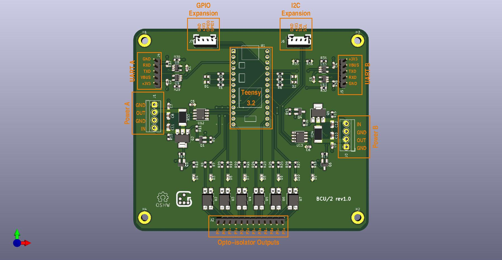

# BCU/2 - Board Control Unit Duo (KiCad PCB)

This is a small board to control operation of two development boards, e.g. on
your desk, or in a board farm.

## Features

  - Controlled by a Teensy 3.2 (https://www.pjrc.com/store/teensy32.html),
  - Two power control and measurement channels (3.3-14V, max. 3.2A),
  - Two UART channels
      - Optional buffer circuitry supports 1.8 to 5V, or fixed 3.3V,
      - Add external MAX3232 board for RS232-compatible voltage levels.
  - Six opto-isolators for e.g. reset, wake-up, and keypress simulation,
  - Two RGB status LEDs,
  - 4-pin I2C expansion connector,
  - 4-pin GPIO expansion connector.

## Software

Software to run on the Teensy is available from
https://github.com/geertu/teensy3-bcu2 in source form.

## License

CC-BY-SA-4.0 (https://creativecommons.org/licenses/by-sa/4.0/)

## PCB and Parts

PCB and parts can be ordered at
https://aisler.net/geert/board-control-unit/bcu-2 (Disclaimer: I'm not
affiliated to AISLER)

## Bill Of Materials

  - C1-C4[A], C5-C7, C9: Capacitor, 100nF, SMD 0603/1608
  - C8, C10-C12: Capacitor, 10µF, SMD 0805/2012, 25V
  - D1, D2: LED RGB Diffused, Common Anode at pin 1, SMD 4PLCC
  - D3, D6-D10: LED Yellow clear, SMD 0603/1608
  - D4, D5: LED Green clear, SMD 0603/1608
  - J1, J3: Screw type, terminal block, RM 3.5mm
  - J2: Male 1x12 header 2.54mm
  - J4, J5: Male 1x5 header, RM 2.54mm
  - J6, J7: Male 1x4 header, RM 2mm, e.g. JST B4B-PH-K
  - J8-J9[B]: Male 1x14 header, RM 2.54mm
  - J10-J11[B]: Female 1x14 header, RM 2.54mm
  - Q1, Q3, Q4, Q6: MOSFET N-channel 60V 115mA, SOT23-3
  - Q2, Q5: MOSFET P-channel 20V 10A, SOT223
  - R1, R4: Resistor, 680Ω, SMD 0603/1608
  - R2, R3, R5, R6: Resistor, 100Ω, SMD 0603/1608
  - R7, R13, R18, R19, R21, R23, R25, R27: Resistor, 1kΩ, SMD 0603/1608
  - R8, R20, R22, R24, R26, R28: Resistor, 270Ω, SMD 0603/1608
  - R9, R14: Resistor, 10kΩ, SMD 0603/1608
  - R10, R11, R15, R16, R37[A], R38[A]: Resistor, 47kΩ, SMD 0603/1608
  - R12, R17: Resistor, 100kΩ, SMD 0603/1608
  - R29-R32[C]: Resistor, 0Ω, SMD 0603/1608
  - R33, R34: Resistor, 100mΩ, SMD 2512/6432, 1%, 2W
  - R35, R36: Resistor, 4.7kΩ, SMD 0603/1608
  - U1: Teensy 3.2
  - U2-U7: Opto-isolator, Mini-Flat-4, e.g. Broadcom HCPL-181-00CE
  - U8-U11[A]: 2-input AND gate 74LV1T08[D], SOT23-5
  - U12, U13: INA219xID power monitor, 8-SOIC

## Connector pinouts

  - J1 / J3: Power channels A & B

    Pin | Function
    --- | --------
     1  | GND
     2  | Power OUT
     3  | GND
     4  | Power IN (3.3-14V, max. 3.2A)

  - J2: Opto-isolator channels 0-5

    Pin               | Function
    ----------------- | --------
     1-11 (odd pins)  | Emitter ("negative output")
     2-12 (even pins) | Collector ("positive output")

  - J4 / J5: UART channels A & B

    Pin | Function
    --- | --------
     1  | GND
     2  | RXD
     3  | TXD
     4  | VBUS (1.8V to 5V), may be jumpered to +3V3
     5  | +3.3V[E]

  - J6: I2C expansion[F]

    Pin | Function
    --- | --------
     1  | GND
     2  | +3.3V[E]
     3  | SDA
     4  | SCL

  - J7: GPIO expansion[F]

    Pin | Function
    --- | --------
     1  | GND
     2  | +3.3V[E]
     3  | GPIO0
     4  | GPIO1

## Footnotes

  * [A] Optional buffer circuitry, mutually exclusive with [C]
  * [B] For Teensy plugin, not on schematic
  * [C] Optional buffer bypass, mutually exclusive with [A]
  * [D] Replace by 74LV1T00 for inverted TXD/RXD logic
  * [E] Maximum current output on the +3.3V pin of the Teensy 3.2 is 250 mA.
	Up to 100-125 mA can be used by expansion peripherals.
  * [F] Pin order of the I2C and GPIO expansion connectors is similar (but
	reversed!) to the Seeed Studio Grove and SparkFun Qwiic Connect
	systems, although the connector used is different (you can probably
	mount a real Grove connector instead).
